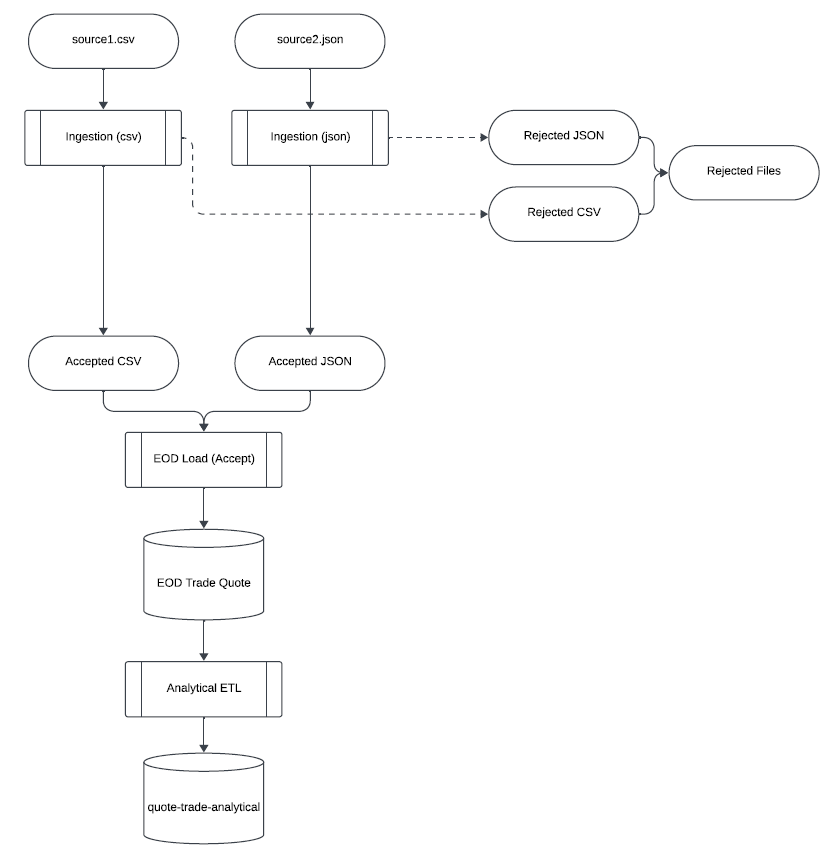

# Equity Market Data Capstone Project
In this project, we seek to build a data pipeline mean to perform daily ingestion of trade and quote data from multiple stock exchanges. Records to be ingested can be comprised of data elements such as exchange name, stock symbol, price, and timestamps. In addition, raw records may be available in both <tt>.json</tt> and <tt>.csv</tt> formats, though individual records must also adhere to an input format to be considered valid. Records may also be need to be updated retroactively to correct for past errors in the raw files.

The primary deliverables for this project include:

1) An EOD batch load of all new records to be appended to Trade and Quote tables. All valid records should be appended, and any updates to previous records should be made as well (without creating duplicates).

2) An Analytical ETL job to create an additional view that merges quote records with trade records, including moving averages of past records. This view would likely be needed to streamlilne analytics use cases for downstream users.

## Architecture Diagram
The first stage of this project is to outline the architecture of the solution. Here, we propose an ingestion script to parse both <tt>.json</tt> and <tt>.csv</tt> files to extract records that are in valid formats. From here, these are then loaded as part of the EOD batch job, appending new records and amending old ones if applicable. Lastly, additional transforms are performed on the result tables to provide an analytic view:

